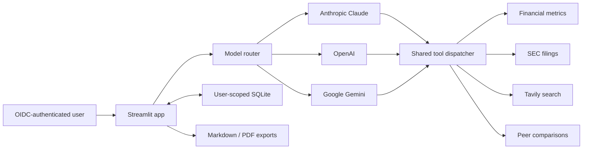

# Alpha Scout — Technical Walkthrough

This document explains the design choices most relevant to a code review or
technical interview. For installation and deployment commands, see
`SETUP_AND_RUN.md`.

## System overview

Alpha Scout is a Streamlit financial-research workspace with three selectable
LLM providers and one shared tool surface.



The provider adapters translate each vendor's function-calling protocol into
the same Python tools. This avoids duplicating business logic and makes routing
testable without making live API calls.

## Request lifecycle

1. Streamlit authenticates the visitor with OpenID Connect.
2. The application derives a stable user identity from the OIDC claims.
3. Conversation history is loaded only for that identity.
4. The selected model receives the underwriting system prompt and conversation.
5. Tool calls are normalized and dispatched to the shared functions.
6. The provider loop returns a final memo and the tickers it researched.
7. Streamlit displays the memo, charts retrieved tickers, persists the response,
   and offers Markdown and PDF downloads.

## Main modules

### `app.py`

The UI entrypoint is intentionally thin:

- configures the Streamlit page;
- requires OIDC authentication with `st.login` and `st.user`;
- optionally enforces the `ALLOWED_EMAILS` authorization allowlist;
- manages current-chat state and user-scoped history;
- invokes `run_smart_agent`;
- renders price charts and report downloads.

Authentication and authorization are separate. OIDC establishes identity, while
the optional allowlist decides which authenticated identities may use a
restricted deployment.

### `search_agent.py`

This module owns:

- provider client construction;
- one canonical set of JSON-schema tool declarations;
- the shared tool dispatcher;
- separate OpenAI, Gemini, and Claude tool-use loops;
- output-size and iteration limits;
- ticker collection for UI charts.

Each provider loop follows the same state machine:

```text
send conversation → inspect response
    ├── final text → return
    └── tool calls → execute tools → append results → repeat
```

The loop is capped by `MAX_TOOL_ITERATIONS`, preventing an accidental infinite
tool cycle.

### `model_config.py`

Model names can be overridden through environment variables. Provider routing
uses exact configured names and known provider prefixes instead of loose
substring checks. Unknown model identifiers are rejected explicitly.

This design supports model upgrades without changing the UI or tool code.

### `metrics.py`

The financial fact layer uses yfinance statements and market data to derive:

- revenue growth and three-year CAGR;
- operating and free-cash-flow margins;
- FCF yield and FCF per share;
- NOPAT, invested capital, and ROIC;
- SBC as a percentage of operating cash flow;
- valuation multiples;
- moving averages, RSI, and one-year return.

Helper functions convert missing or invalid values to `None`. The goal is a
consistent evidence layer, not false precision. Missing data should remain
missing so the model can state uncertainty.

### `database.py`

SQLite stores sessions and messages. Every session includes a `user_id`, and
every read, write, update, and delete checks ownership.

Important implementation details:

- parameterized SQL protects against injection;
- foreign keys are enabled for every connection;
- indexes support user/session lookups;
- context managers commit or roll back transactions;
- an idempotent startup migration adds `user_id` to older databases;
- legacy message cleanup works even if the old foreign key lacked cascade.

The default path is `data/alpha_scout.db`. Docker deployments mount `/app/data`
as a volume. A managed database is preferable for multi-instance production.

### `analysis_protocol.md`

The system prompt defines the research contract. It requires a verdict,
scenario analysis, explicit 2x math, business reality, peer comparisons,
variant perception, catalysts, capital allocation, financial quality, bear
case, and measurable kill criteria.

Keeping the protocol outside Python makes it reviewable and editable without
changing provider code.

### `config.py`

Configuration is loaded from environment variables. It includes provider API
keys, SEC identity, database path, optional email allowlist, UI metadata, model
choices, and cache duration.

Secrets are never committed. Local development uses `.env` for API values and
`.streamlit/secrets.toml` for OIDC. Hosted Streamlit secrets use the same TOML
shape.

## Security model

- Native OIDC replaces the former shared-password gate.
- CORS and XSRF protections remain enabled.
- Conversations are isolated by authenticated user.
- The Docker image runs as non-root UID 10001.
- The production secrets file and local database files are ignored by Git.
- Tool loops have iteration and output limits.
- The app performs research only; it does not execute trades.

OIDC provides authentication, not automatic authorization. Restrict private
deployments with the identity provider, `ALLOWED_EMAILS`, or both.

## Testing strategy

The deterministic suite covers:

- database lifecycle and ownership boundaries;
- migration of legacy SQLite schemas;
- deletion behavior for legacy messages;
- model-to-provider routing;
- tool argument normalization;
- Tavily result truncation and raw-content removal;
- evaluation-dataset schema and category coverage.

Tests mock network clients and do not assert LLM prose. Model outputs are
nondeterministic, so behavioral quality belongs in rubric-based evaluation.

The `evals/financial_research_questions.json` dataset contains 25 cases across
underwriting, comparisons, SEC research, current events, financial quality,
safety, and edge cases.

## Reliability and operational choices

- Streamlit market charts use a one-hour cache.
- Provider and tool failures return explicit error text rather than crashing the
  Streamlit process.
- Docker includes a Streamlit health check.
- GitHub Actions runs the deterministic suite on pushes and pull requests.
- Dependencies are pinned in one `requirements.txt`.

## Key tradeoffs

### SQLite versus managed Postgres

SQLite is simple and appropriate for a single-instance demo with a persistent
volume. It is not the right final datastore for horizontally scaled deployment.
The repository keeps its persistence API small so a managed implementation can
replace it later.

### Three provider adapters versus one abstraction SDK

Direct SDK integrations require more adapter code, but they demonstrate
provider-specific tool calling and avoid coupling the project to another
framework. The shared dispatcher contains the domain behavior, limiting the
duplication.

### Broad financial data versus institutional precision

yfinance offers convenient coverage but not institutional guarantees. The
agent is instructed to disclose uncertainty, use SEC filings for primary-source
research, and avoid treating missing values as zero.

## Interview discussion prompts

- How would you move persistence to Postgres without changing the UI?
- How would you add per-user rate limits and cost budgets?
- How would you compare provider quality and tool-use accuracy over the eval set?
- Which tools should be cached, and how would you invalidate them?
- How would you add citations that remain linked to individual claims?
- How would you trace provider calls and diagnose a failed research run?

These are intentional extension points rather than hidden limitations.
