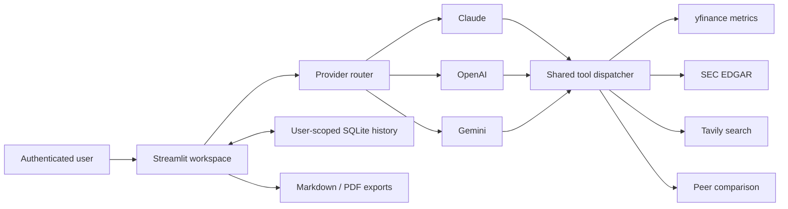

# Alpha Scout

AI-powered financial research workspace with multi-provider LLM agents, market
data tools, SEC research, persistent conversations, and exportable reports.

Alpha Scout turns a public-company ticker into a structured, evidence-seeking
underwriting memo. Users can route the same research workflow through Claude,
OpenAI, or Gemini while the agent calls a shared set of market-data, SEC, peer,
and current-news tools.

> Alpha Scout is a research demonstration, not investment advice. Market data
> may be delayed, incomplete, or incorrect.

## Highlights

- **Multi-provider agent routing** across Anthropic Claude, OpenAI, and Google
  Gemini.
- **Tool calling** for yfinance metrics, SEC EDGAR filings, Tavily web research,
  and public-company peer comparisons.
- **Forensic underwriting protocol** with scenario math, variant perception,
  catalysts, capital allocation, bear cases, and kill criteria.
- **Persistent, user-isolated conversations** in SQLite with an environment
  path ready for a mounted volume.
- **Real user authentication** through Streamlit's native OpenID Connect flow.
- **Exportable Markdown and PDF reports** with a presentation-ready layout.
- **Deterministic unit tests and a 25-case evaluation set** spanning core
  research, tool selection, safety, and edge cases.
- **Container and CI support** with a non-root Docker user, health check, pinned
  dependencies, and GitHub Actions.

## Architecture



The provider implementations use different function-calling APIs but converge
on one tool schema and dispatcher. That keeps the financial research behavior
consistent while making provider routing explicit and testable.

## Example output

See the [illustrative research memo](docs/sample_report.md). It shows the report
shape without presenting placeholder figures as current market data.

## Run locally

Requirements:

- Python 3.12
- API keys for Anthropic, OpenAI, Google Gemini, and Tavily
- An OIDC client from Google, Microsoft Entra ID, Okta, Auth0, or another
  OpenID Connect provider

```bash
git clone https://github.com/manojmaddipoti/alpha-scout.git
cd alpha-scout
python3.12 -m venv .venv
source .venv/bin/activate
pip install -r requirements.txt
cp .env.example .env
mkdir -p .streamlit
cp .streamlit/secrets.example.toml .streamlit/secrets.toml
streamlit run app.py
```

Add the provider API keys to `.env`. Configure the OIDC values in
`.streamlit/secrets.toml` and register
`http://localhost:8501/oauth2callback` as an allowed redirect URL with the
identity provider. The real secrets file is ignored by Git.

For a restricted deployment, set `ALLOWED_EMAILS` to a comma-separated list.
When it is unset, any account accepted by the configured identity provider can
sign in; each account still sees only its own conversations.

## Configuration

| Setting | Required | Purpose |
|---|---:|---|
| `ANTHROPIC_API_KEY` | Yes | Claude access |
| `OPENAI_API_KEY` | Yes | OpenAI access |
| `GOOGLE_API_KEY` | Yes | Gemini access |
| `TAVILY_API_KEY` | Yes | Current web research |
| `SEC_IDENTITY` | Yes | SEC-compliant name and email identity |
| `ALLOWED_EMAILS` | No | Optional signed-in user allowlist |
| `DB_PATH` | No | SQLite path; defaults to `data/alpha_scout.db` |
| `CLAUDE_MODEL` | No | Overrides the configured Claude model |
| `OPENAI_MODEL` | No | Overrides the configured OpenAI model |
| `GEMINI_MODEL` | No | Overrides the configured Gemini model |

OIDC settings belong under `[auth]` in `.streamlit/secrets.toml`, not in source
control. Streamlit requires `redirect_uri`, `cookie_secret`, `client_id`,
`client_secret`, and `server_metadata_url`.

## Test and evaluate

Run deterministic tests for database access controls, migrations, tool
dispatch, response sanitization, provider routing, and evaluation-data quality:

```bash
pytest -q
```

The [25-case financial research set](evals/financial_research_questions.json)
covers:

- full equity underwriting;
- company and peer comparisons;
- SEC filing analysis;
- current events;
- financial quality;
- financial-safety scenarios;
- invalid, ambiguous, and metric-inappropriate requests.

Model response quality belongs in rubric-based evaluation rather than brittle
unit assertions. See [evaluation notes](evals/README.md).

## Docker

```bash
docker build -t alpha-scout .
docker run --env-file .env \
  -v alpha-scout-data:/app/data \
  -v "$PWD/.streamlit/secrets.toml:/app/.streamlit/secrets.toml:ro" \
  -p 8501:8501 \
  alpha-scout
```

The image runs as an unprivileged user, keeps CORS and XSRF protection enabled,
and exposes a Streamlit health check. The named volume makes SQLite persistent
across container replacement.

## Deploy on Streamlit Community Cloud

1. Create an app from this GitHub repository and select `app.py`.
2. Choose Python 3.12.
3. Paste the `.env` API values and `[auth]` OIDC configuration into the
   deployment's Secrets settings.
4. Change the OIDC redirect URI to
   `https://<your-app>.streamlit.app/oauth2callback` in both Streamlit secrets
   and the identity-provider client.
5. Add the final app URL to this README after verifying authentication and one
   end-to-end research request.

Community Cloud's local filesystem is not durable application storage. The
default SQLite database is appropriate for local and container demos with a
volume; use managed Postgres or another durable database before relying on chat
history in a multi-instance production deployment.

## Project structure

```text
alpha-scout/
├── .github/workflows/tests.yml       # CI test workflow
├── .streamlit/                       # Secure server defaults and auth example
├── docs/sample_report.md             # Illustrative output
├── evals/                            # 25-case research evaluation set
├── tests/                            # Deterministic unit tests
├── analysis_protocol.md              # Underwriting system prompt
├── app.py                            # Authenticated Streamlit workspace
├── config.py                         # Environment-backed configuration
├── database.py                       # User-scoped SQLite persistence
├── metrics.py                        # Financial and competitor metrics
├── model_config.py                   # Provider/model routing configuration
├── search_agent.py                   # Tool calling and provider loops
├── requirements.txt                  # Single pinned dependency definition
└── Dockerfile
```

## Security

- OIDC replaces the former shared application password.
- Saved conversations are filtered by the authenticated user's stable identity.
- CORS and XSRF protections are explicitly enabled.
- Production secrets stay outside the repository.
- The application does not execute trades or guarantee investment outcomes.
